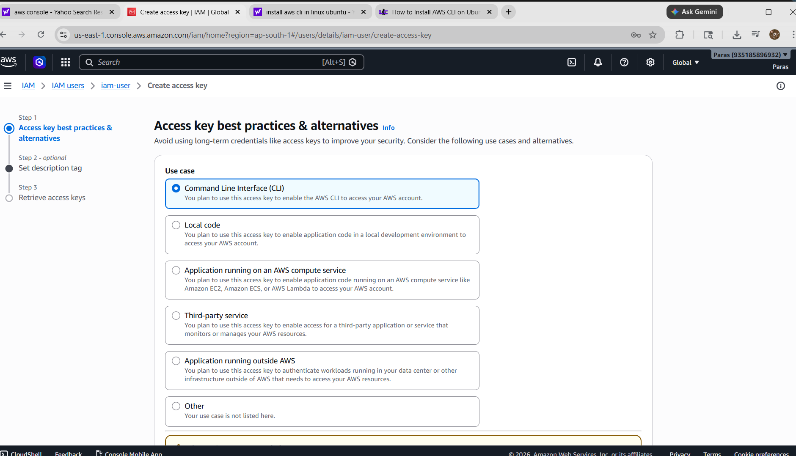
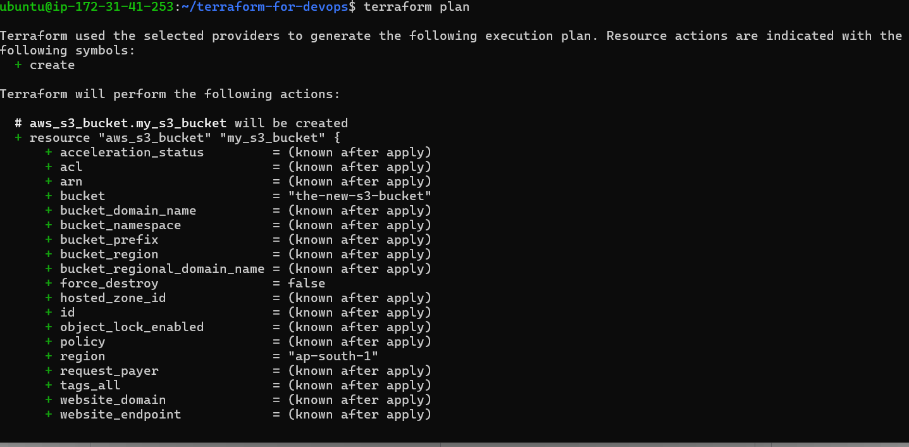
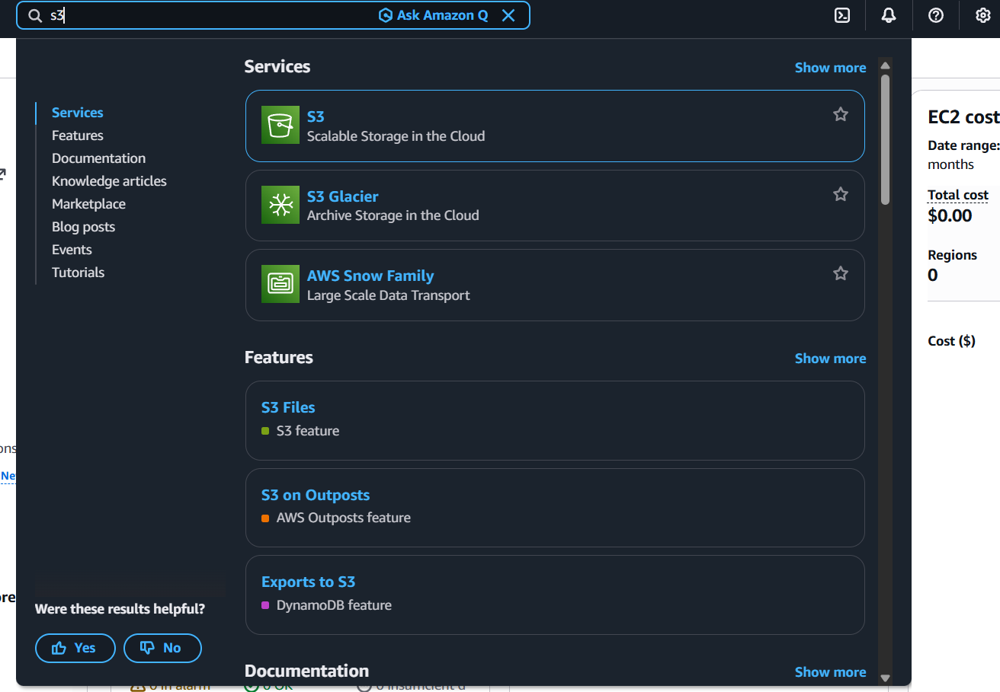

# Terraform Script to Configure AWS S3 bucket


This repository contains Terraform scripts to configure AWS infrastructure resources using Infrastructure as Code (IaC).

## Prerequisites

Before running this project, install the following tools:

* Terraform
* AWS CLI
* AWS Account with IAM User Access Keys

---

# Install Terraform on Ubuntu/Linux

## Step 1: Update System

```bash
sudo apt update
sudo apt install -y unzip wget
```

## Step 2: Download Terraform

```bash
wget https://releases.hashicorp.com/terraform/1.15.2/terraform_1.15.2_linux_amd64.zip
```

## Step 3: Extract Terraform

```bash
unzip terraform_1.15.2_linux_amd64.zip
```

## Step 4: Move Terraform Binary

```bash
sudo mv terraform /usr/local/bin/
```

## Step 5: Verify Installation

```bash
terraform -version
```

Expected Output:

```bash
Terraform v1.15.2
```

---

# Install AWS CLI on Ubuntu/Linux

## Step 1: Download AWS CLI

```bash
curl "https://awscli.amazonaws.com/awscli-exe-linux-x86_64.zip" -o "awscliv2.zip"
```

## Step 2: Install Unzip

```bash
sudo apt install unzip -y
```

## Step 3: Extract ZIP File

```bash
unzip awscliv2.zip
```

## Step 4: Install AWS CLI

```bash
sudo ./aws/install
```

## Step 5: Verify Installation

```bash
aws --version
```

Expected Output:

```bash
aws-cli/2.x.x
```

---

# Configure AWS CLI

## Step 1: Create IAM User in AWS

1. Login to AWS Console
2. Open IAM Service
3. Go to Users
4. Click Create User
5. Provide username
6. Attach Permissions:

   * AdministratorAccess (for testing/demo)
7. Create User

---

# Generate Access Key

1. Open IAM User
2. Go to Security Credentials
3. Click Create Access Key
4. Select CLI Use Case
5. Download or Copy:

   * Access Key ID
   * Secret Access Key

### Screenshot



---

# Configure AWS CLI

Run:

```bash
aws configure
```

Enter:

```bash
AWS Access Key ID: YOUR_ACCESS_KEY
AWS Secret Access Key: YOUR_SECRET_KEY
Default region name: ap-south-1
Default output format: json
```

---

# Clone Repository

```bash
git clone https://github.com/Paras9069/terraform-script-to-configure-aws-.git
```

## Move into Project Directory

```bash
cd terraform-script-to-configure-aws-
```

---

# Initialize Terraform

```bash
terraform init
```

---

# Validate Terraform Files

```bash
terraform validate
```

---

# Preview Infrastructure Changes

Run:

```bash
terraform plan
```

Terraform will show the execution plan and resources that will be created.

### Screenshot



---

# Create AWS Infrastructure

Run:

```bash
terraform apply
```

Type:

```bash
yes
```

Terraform will start creating AWS resources.

### Screenshot


---

# Open Amazon S3 Console

Search for **S3** in AWS Console and open the S3 dashboard.

### Screenshot



---

# S3 Bucket Successfully Created

The S3 bucket has been successfully created using Terraform.

### Screenshot


---

# Destroy Infrastructure

```bash
terraform destroy
```

---

# Common Terraform Commands

## Check Terraform Version

```bash
terraform -version
```

## Show Current Infrastructure State

```bash
terraform show
```

## Format Terraform Files

```bash
terraform fmt
```

---

# Project Structure

```bash
.
├── main.tf
├── variables.tf
├── outputs.tf
└── README.md
```

---

# Technologies Used

* Terraform
* AWS CLI
* AWS IAM
* Amazon Web Services (AWS)

---

# Author

Paras Sharma
